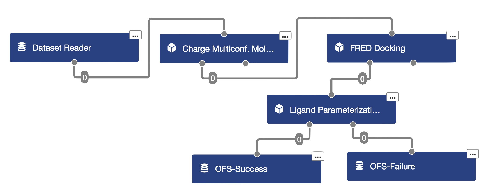
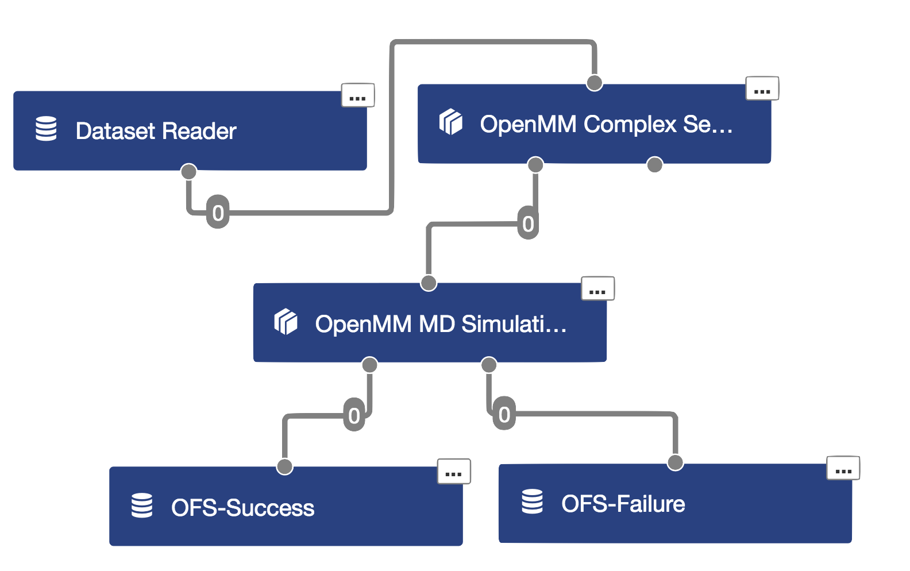

# OpenMM cubes and workfloes for Orion

## Cube sets

* `PlatformTestCubes/` - simple example cube for testing available OpenMM PlatformTestCubes
* `LigPrepCubes/` - Cubes for preparing molecules
  * `ChargeMCMol` - Assigns partial charges and generates multi-conf molecules with OMEGA
  * `FREDDocking` - Dock MCMols using FRED to a prepared receptor
  * `LigandParameterization` - Parametrize molecules with either GAFF/GAFF2/SMIRNOFF forcefields
* `OpenMMCubes/` - OpenMM utility cubes
  * `OpenMMComplexSetup` - Generate a solvated protein:ligand complex.
  * `OpenMMSimulation` - Runs and OpenMM MD simulation. Minimizes or restarts from saved State.
* `YankCubes/` - YANK cubes
  * `YankHydrationCube` - YANK hydration free energy calculations
  * `YankBindingCube` - YANK absolute binding free energy calculations

## Workfloes
* Testing Floes:
  * `floes/platformTest.py` - Check available OpenMM Platforms
  * `floes/openmm_benchmarking.py` - Performs Benchmarking upon all available Platforms.
* [Walkthrough](#walkthrough-from-smiles-to-simulation) Floes:
  * `floes/smiles_ligprep.py` - Parse SMILES, assign charges, docks, and parameterizes the molecules with GAFF/GAFF2/SMIRNOFF forcefield parameters
  * `floes/openmm_complex_min.py` - Setup the protein:ligand complex, minimize and run 1ps MD.
  * `floes/openmm_md.py` - Run MD simulation from a prepared dataset (i.e complex.oeb.gz)
* Yank Floes:
  * `floes/yank_hydration.py` - Compute small molecule hydration free energies using YANK.
  * `floes/yank_binding.py` - Compute small molecule absolute binding free energies using YANK.
* Other Floes:
  * `floes/openmm_complex_setup.py` - Setup the protein:ligand complex from **PDBs**.
  * `floes/smiles_complex_setup.py` - Parse SMILES, prepare ligands (above), and generate the protein:ligand complex.

## Local Installation
```bash
git clone git@github.com:openeye-private/openmm_orion.git
cd openmm_orion

#Create a new local conda environment and install dependencies
conda env create -f .environment.yml -n dev
source activate dev

#Download the latest floe package and place into the openmm_orion directory
# Latest package as of April, 28th
cp OpenEye-floe-0.2.148.tar.gz openmm_orion/
pip install OpenEye-floe-0.2.148.tar.gz

pip install -r dev_requirements.txt

# Run the tests.
py.test -v -s PlatformTestCubes
py.test -v -s LigPrepCubes
py.test -v -s OpenMMCubes
py.test -v -s YankCubes
```
## Walkthrough from SMILES to Simulation

### [FLOE] SmilesLigPrep: Preparing a molecule dataset from SMILES strings.


```bash
# Launch from the command line
python floes/smiles_ligprep.py --ligand examples/data/TOL.ism \
--molecule_forcefield SMIRNOFF \
--receptor examples/data/T4-receptor.oeb.gz \
--ofs-data_out TOL-smnf.oeb.gz --fail-data_out fail.oeb.gz
```

This floe intended to run on CPU-Orion as it does not make use of any GPUs.
Within this floe, we will take a SMILES string and preparing it for an MD simulation
with OpenMM. In short, the floe will generate the 3D structure, assign charges, dock
and parameterize the molecule. Cubes references in this floe are nested under `LigPrepCubes.cubes`.

The first cube uses OpenEye's native `OEMolIStreamCube` to parse a file containing SMILES strings and emit each `oechem.OEMol`.

#### [Cube] `ChargeMCMol`
In the `ChargeMCMol` cube, it will call functions from the package [openmoltools](https://github.com/choderalab/openmoltools/blob/master/openmoltools/openeye.py) in order to check aromaticity, add explicit hydrogens, and obtain the IUPAC name of the molecule. Then, the cube generates multiple conformers with OMEGA and assign charges using the new `oequacpac.OEAssignCharges` function. By default, the charging engine used is set to `OEAM1BCCCharges`. Before emitting, the IUPAC name and molecule title are stored as SDData using the tags `IUPAC` and `IDTag`, respectively.

###### Note: The IDTag/molecule title is obtained from the text next to the SMILES string from the input file, (i.e. `Cc1ccccc1 TOL`) or it is randomly generated if not present.

#### [Cube] `FREDDocking`
*Requires the `--receptor` argument which should be a prepared receptor file using the OpenEye Toolkits. (See [docs](https://docs.eyesopen.com/toolkits/python/dockingtk/receptor.html#creating-a-receptor))*

Next, the charged multi-conformer molecules are docked with `FREDDocking` which uses the FRED or ChemGauss4 docking engine. The pose score and docking method is attached as SDData before emitting.

#### [Cube] `LigandParameterization`
*Choose forcefield with `--molecule_forcefield`. Supports GAFF, GAFF2, [SMIRNOFF](https://github.com/open-forcefield-group/smirff99Frosst) forcefields.*

The `LigandParameterization` cube supports parameterizing the molecule with GAFF, GAFF2, or the [SMIRNOFF](https://github.com/open-forcefield-group/smirff99Frosst) forcefields. By default, this cube will use GAFF2. After docking, the molecules are passed into `LigandParameterization` where a forcefield parameterized `parmed.Structure` is generated for the respective molecule and attached as generic data.

Molecules (with the `parmed.Structure` attached) are then passed to OpenEye's `OEMolOStreamCube` and written into a dataset file (`oeb.gz`).

### [FLOE] MinimizeComplex: Generate and minimize the protein:ligand complex.

```bash
# Launch from command line
python floes/openmm_complex_min.py --ligand TOL-smnf.oeb.gz --protein examples/data/T4-protein.pdb \
--complex_setup-pH 6.8 --complex_setup-salt_concentration 200 \
--ofs-data_out TOL-min.oeb.gz --fail-data_out fail.oeb.gz
```

This floe is intended to run on GPU-Orion. Now that we have our molecules parameterized, we're going to generate our entire OpenMM system in this floe. That is, we will be generating a parameterized TIP3P solvated protein:ligand complex, minimize it and then run a 1ps MD simulation. Here we'll be making use of GPUs and parallel cubes to speed things along. Cubes references in this floe are nested under `OpenMMCubes.cubes`.

Here, we take the dataset containing our parameterized molecules and feed that into the Dataset Reader cube again.

#### [Cube] `OpenMMComplexSetup`
*Requires the `--protein` argument which points to a pdb file of just the protein.*

The cube assumes:
* Streamed-in molecule has the `parmed.Structure` attached.
* `parmed.Structure` of the molecule is in the docked pose.

The cube will combine the `parmed.Structure` of the molecule with a parameterized protein `parmed.Structure` using the `amber99sbildn` forcefields. The merged protein:ligand complex is passed to PDBFixer which is used to add in missing atoms, assign the protonation states on titratable residues, and solvate the complex with TIP3P water models. PDBFixer will attempt to add in missing residues if it finds a SEQRES field in the PDB file. A `parmed.Structure` of the 'fixed' solvated protein:ligand system is attached to the molecule and emitted.

###### Note: Expecting to replace PDBFixer with a more robust tool.

#### [Cube] `OpenMMSimulation`
*This cube checks for a `State` tag and can restart the simulation from the saved state.*

The simulation cube expects the streamed-in molecule to have a `parmed.Structure` of the entire system ready for an OpenMM simulation. Molecules being streamed in will be minimized and then run briefly for 1ps. The attached `parmed.Structure` is updated to reflect the final state of the simulation and an encoded `state.xml` gets attached as generic data with the tag `State` before emitting. Additionally, a LZMA compressed tar file (`tar.xz`) is generated which contains:

1. PDB file of the entire system
2. State XML
3. Trajectory file (AMBER NETCDF format)
4. Log file reporting the energies.


After the simulation, the molecules are passed to the dataset writer cube and written to a dataset file.

### [FLOE] RunOpenMMSimulation: Restart/Extend the MD Simulation.
Now, the dataset from the previous floe can just be passed to any floe which uses the simulation cube. It will restart the simulation from the saved State that is attached as generic data. For example:
```bash
python floes/openmm_md.py --complex examples/data/TOL-min.oeb.gz --steps 10000
```

## Other Floe Examples:
### Starting from PDBs
#### [SetupOpenMMComplex]: Setup the protein:ligand complex.
*Assuming input ligand PDB is in docked position*
Setup the protein-ligand complex.
```
python floes/openmm_complex_setup.py --ligand examples/data/toluene.pdb --protein examples/data/T4-protein.pdb

# Available options
python floes/openmm_complex_setup.py --ligand examples/data/toluene.pdb --protein examples/data/T4-protein.pdb --ffxml smirff99Frosst.ffxml --protein_ff amber99sbildn.xml --solvent_ff tip3p.xml --pH 7.0 --salt_conc 10
```

#### [SetupOpenMMSimulation]: Setup and simulate the protein:ligand complex.
Does the same above and run 10,000 MD steps.
```
python floes/openmm_setup_md.py --ligand examples/data/toluene.pdb --protein examples/data/T4-protein.pdb --steps 10000
```
